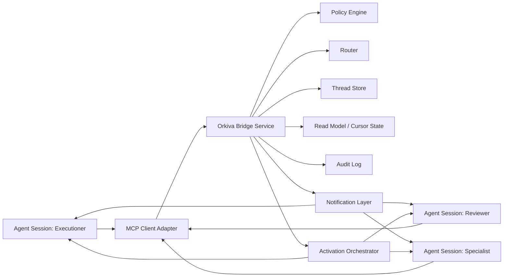

# Solution Architecture

## 1. Architecture Overview
Orkiva is implemented as an MCP-accessible service with durable thread/message storage and policy-enforced routing.

## 2. Core Components
### 2.1 MCP Client Adapter
Responsibility:
- expose `post_message`, `read_messages`, `create_thread`, `update_thread_status`, and related methods
- normalize agent identity and session metadata

### 2.2 Bridge Service
Responsibility:
- validate requests
- apply policy checks
- persist thread/message state
- dispatch notifications

### 2.3 Router
Responsibility:
- resolve direct recipients, role recipients, and broadcast recipients
- apply participant membership constraints

### 2.4 Policy Engine
Responsibility:
- verify sender permissions for thread/project/workspace
- validate platform-issued signed identity claims
- enforce guardrails (message size, rate limits, restricted tags)
- enforce escalation and loop thresholds

### 2.5 Storage
MVP storage:
- Postgres for threads, participants, messages, cursors, and event log

Scale-up options:
- Redis streams or queue for higher-throughput notification fanout

### 2.6 Notification Layer
MVP:
- unread-state polling via `read_messages` with cursor
- trigger dispatch requests to activation orchestrator

Future:
- optional push/subscription transport if runtime supports it

### 2.7 Activation Orchestrator
Responsibility:
- decide when a participant is dormant and needs a wake trigger
- invoke runtime-specific wake commands
- record wake attempts, outcomes, and retries

Codex CLI adapter behavior:
- preferred wake command: `codex exec resume <session_id> \"<trigger prompt>\"`
- fallback when session is not resumable: spawn a new worker session and rehydrate context from thread summary

### 2.8 Orchestration Mode (Resolved)
MVP orchestration mode: hybrid.

Mode behavior:
- trigger-first: orchestrator wakes dormant participants on unread messages
- polling fallback: participants/supervisor periodically reconcile unread state
- failure fallback: timeout/retry then `resume`/spawn recovery

### 2.9 Primary Control Model (Explicit)
Control entrypoint:
- one orchestrator agent is the primary human-facing control plane

Execution model:
- orchestrator delegates tasks to worker agents
- worker agents are secondary interaction lanes and can be directly overridden when required

Intervention rule:
- direct human interaction with worker panes is allowed, but orchestrator should be updated to keep workflow state consistent

## 3. Data Flow
### 3.1 Send Message
1. Agent calls `post_message`.
2. Service authenticates sender.
3. Policy engine validates sender/thread permissions.
4. Router resolves recipients.
5. Message persisted atomically.
6. Notification markers updated.
7. Ack returned with message ID and sequence.

### 3.2 Read Messages
1. Agent calls `read_messages(thread_id, since_seq)`.
2. Service returns ordered messages and next cursor.
3. Agent updates local checkpoint.
4. Optional `ack_read` updates participant seen state.

### 3.3 Escalation
1. Guard detects loop, timeout, or conflict.
2. Service marks thread `blocked`.
3. Escalation event posted with summary.
4. Human operator or coordinator agent intervenes.

### 3.4 Dormant Participant Wake-Up
1. New message arrives for participant.
2. Service checks participant heartbeat/read lag policy.
3. If participant is dormant, activation orchestrator issues runtime wake command.
4. Wake result is logged (`triggered`, `already_active`, `failed`, `fallback_spawned`).

### 3.5 Polling Fallback Reconciliation
1. Supervisor runs periodic unread-state polling.
2. If unread exists without successful trigger acknowledgement, supervisor retries trigger path.
3. If retries are exhausted, supervisor executes fallback (`resume`/spawn) and logs outcome.

## 4. Identity and Session Model
Each call includes:
- `agent_id` (stable role identity, example: `reviewer_agent`)
- `session_id` (ephemeral runtime instance)
- `workspace_id`
- optional `task_id` and `branch`

Principle:
- permissions bind to verified token claims (`agent_id`, `workspace_id`, `role`)
- observability tracks both verified `agent_id` and `session_id`
- runtime-provided identity fields are informational only and must match verified claims
- MVP trust domain is single-workspace; cross-workspace routing is rejected

Session registry requirement:
- Maintain latest resumable session per `agent_id` and workspace (`session_id`, `last_heartbeat_at`, `resumable=true|false`).

## 5. Thread Model
Thread states:
- `active`: normal message exchange
- `blocked`: requires escalation or missing dependency
- `resolved`: success criteria met
- `closed`: archived and no new messages allowed

Thread types:
- `conversation`: general chat and reasoning
- `workflow`: chat plus structured event progression
- `incident`: escalation-focused coordination

## 6. Ordering and Consistency
MVP consistency model:
- strong ordering per thread using monotonic sequence number
- eventual propagation to recipients via polling

Guarantees:
- no duplicate side effects for same idempotency key
- deterministic per-thread replay order

## 7. Reliability Strategy
- idempotency keys on write APIs
- bounded retry with backoff for transient failures
- dead-letter capture for malformed/unroutable messages
- heartbeat/health endpoints for service monitoring

## 8. Tradeoffs
### Why MCP Tool First
Pros:
- compatible with existing agent integration patterns
- minimal friction for adoption
- explicit tool contract

Cons:
- polling overhead in MVP
- requires adapter integration in each agent runtime

### Why Postgres From Day One
Pros:
- stronger concurrent write behavior
- better durability and operational readiness for growth
- avoids risky early migration after pilot

Cons:
- higher setup/ops complexity than SQLite

## 9. Evolution Path
Phase 1:
- Postgres + hybrid orchestration (trigger-first with polling fallback)

Phase 2:
- richer query and retention controls

Phase 3:
- optional streaming notification path
- advanced routing rules and policy expressions

Versioning baseline:
- endpoint version `/v1`
- payload schema version field for message/event compatibility
