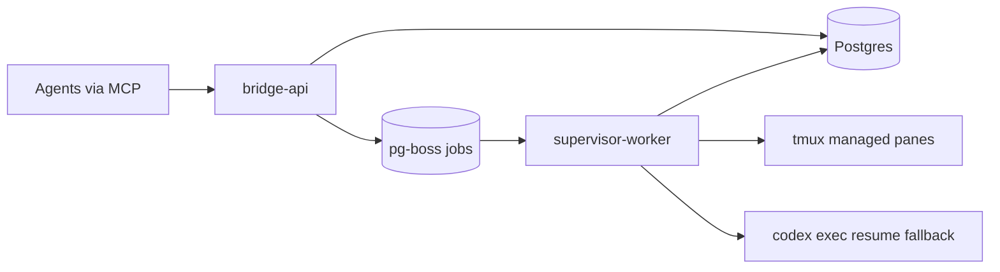

# Technical Stack and Architecture Baseline (MVP)

## 1. Purpose
This document locks the implementation stack and runtime architecture so execution can start without more foundational debate.

## 2. Locked Stack Decisions
### 2.1 Language and Runtime
- Runtime: `Node.js 22 LTS`
- Language: `TypeScript 5.x` (strict mode)
- Package manager: `pnpm`

Why:
- Fast implementation speed for MCP + CLI integration.
- Strong typing for protocol contracts and policy logic.
- Mature ecosystem for Postgres, JWT validation, and process control.

### 2.2 Service and Protocol Layer
- HTTP/API framework: `Fastify`
- MCP surface: `@modelcontextprotocol/sdk`
- Validation: `zod`
- Serialization: JSON only for MVP

Why:
- Fastify is lightweight and operationally simple.
- MCP SDK keeps tool surface standard and avoids custom protocol risk.

### 2.3 Data and Queue Layer
- Primary database: `PostgreSQL 16`
- ORM + migration: `Drizzle ORM` + `drizzle-kit`
- Queue: `pg-boss` (Postgres-backed)

Why:
- Postgres is already locked for MVP.
- `pg-boss` avoids introducing Redis in MVP while still providing retries, delays, and worker semantics.

### 2.4 Security and Identity
- Token verification: `jose`
- Auth model: platform-issued signed short-lived tokens (already locked in requirements)
- Audit logging: immutable append-only event table

### 2.5 Process/Runtime Control
- Managed PTY backend: `tmux` (WSL/Linux MVP)
- OS command execution: Node `child_process` with strict allowlist
- Fallback wake path: `codex exec resume <session_id> <prompt>`

### 2.6 Observability and Reliability
- Structured logs: `pino`
- Metrics: `prom-client` (Prometheus format)
- Health checks: `/health/live` and `/health/ready`

### 2.7 Testing and Quality
- Unit/integration tests: `vitest`
- HTTP contract tests: `supertest`
- DB integration tests: `testcontainers` (Postgres)
- Lint/format: `eslint` + `prettier`

## 3. Architecture Style
Use a modular monolith codebase with two runtime processes:

1. `bridge-api`:
- MCP tool endpoints
- thread/message/session domain logic
- policy enforcement
- trigger job scheduling

2. `supervisor-worker`:
- consumes trigger jobs
- performs tmux trigger delivery
- applies collision policy and fallback chain
- writes trigger outcomes and audits

This keeps implementation simple while isolating runtime-control concerns from API request handling.

## 4. Runtime Topology (MVP)

## 5. Core Module Boundaries
Inside `bridge-api`:
- `threads`: lifecycle and participants
- `messages`: post/read/ack and ordering
- `sessions`: heartbeat and runtime registry metadata
- `trigger-orchestration`: wake policy and job enqueue
- `governance`: authority model, loop guards, rate guards

Inside `supervisor-worker`:
- `runtime-registry-client`
- `tmux-adapter`
- `collision-controller`
- `fallback-resume-spawn`
- `trigger-attempt-audit`

## 6. Database Baseline (MVP)
Initial tables:
- `threads`
- `thread_participants`
- `messages`
- `participant_cursors`
- `session_registry`
- `trigger_jobs`
- `trigger_attempts`
- `audit_events`

Notes:
- All timestamps in UTC.
- Use monotonic `seq` per thread for ordering.
- Keep idempotency key index for safe retries.

## 7. Implementation Defaults Carried Forward
- One workspace trust domain.
- One tmux session per workspace.
- One pane/window per worker role.
- Managed runtime required for autonomous trigger lane.
- Collision handling defaults: `20s` quiet window, `5s` defer re-check, `60s` max defer.
- Explicit runtime ACK marker is optional for MVP.

## 8. Explicitly Deferred
- Redis/NATS/Kafka event streaming.
- Web dashboard.
- Cross-workspace federation.
- Automated content filtering/redaction.
- ConPTY backend (Windows) beyond tmux MVP.
