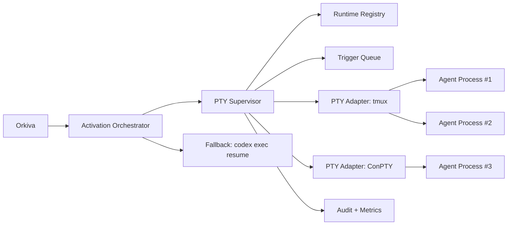

# Process-Level Trigger Engineering Design (PTY Supervisor)

## 1. Purpose
Design a native mechanism to trigger currently running agent processes (not only logical session resume) while keeping each agent visible in its own terminal tab/pane for human monitoring.

This document complements the session-bridge design by solving runtime activation at the OS process layer.

## 2. Problem Statement
`codex exec resume <session_id> <prompt>` restores conversation context, but it starts a new process. It does not inject input into an already running interactive process in another terminal tab.

Goal:
- Trigger live agent processes directly when possible.
- Preserve human-visible interactive terminals per agent.

## 3. Key Definitions
- Logical session: persisted conversation/thread history (`session_id`).
- OS process: currently running runtime instance with PID and attached TTY.
- Managed runtime: agent process started under supervisor control with known PTY handle.
- Unmanaged runtime: manually started terminal tab with no supervisor handle.

## 4. Scope
In scope:
- Process-level trigger delivery to managed agent runtimes.
- Session-level fallback (`resume`) when process-level trigger cannot be completed.
- Human visibility in dedicated tabs/panes.
- Collision-aware trigger behavior when human and automation target the same pane.

Out of scope:
- Injecting reliably into arbitrary unmanaged terminal windows.
- Desktop GUI keystroke automation as primary control channel.
- Multi-host federation in first release.

## 5. Requirements
## 5.1 Functional Requirements
- FR-P1: Supervisor must register and track active agent runtimes.
- FR-P2: Trigger service must send prompt input to target runtime PTY.
- FR-P3: Trigger delivery must produce explicit outcome (`delivered`, `timeout`, `failed`).
- FR-P4: If process trigger fails, system must fallback to `resume` and then optional spawn.
- FR-P5: Human operator must be able to observe each agent terminal live.
- FR-P6: Trigger operations must be auditable and tied to thread/trigger IDs.
- FR-P7: Autonomous trigger delivery is supported only for managed runtimes.
- FR-P8: Human-input collision policy defaults to defer-and-queue with explicit override path.

## 5.2 Non-Functional Requirements
- NFR-P1: p95 trigger dispatch to PTY write <= 1 second on local host.
- NFR-P2: No arbitrary shell execution from trigger payload.
- NFR-P3: At-least-once trigger attempt with idempotent trigger IDs.
- NFR-P4: Cross-platform strategy (WSL/Linux first, Windows next).

## 6. Solution Options
## Option A: Session-Only Resume
- Use `codex exec resume` for all wakeups.
- Pros: simple, low coupling.
- Cons: does not wake existing live process; process continuity lost.

## Option B: PTY Supervisor + Resume Fallback (Recommended)
- Manage runtime processes under known PTYs.
- Inject prompt into live PTY when active.
- Fallback to `resume` if runtime missing/unresponsive.
- Pros: true live-process trigger + robust fallback.
- Cons: requires supervisor daemon and runtime registration discipline.

## Option C: OS UI Keystroke Automation
- Send synthetic keys to arbitrary windows.
- Pros: works with unmanaged tabs in some cases.
- Cons: fragile focus-dependent behavior, security risk, non-deterministic.

Decision:
- Choose Option B.

## 7. Architecture

## 8. Components
## 8.1 PTY Supervisor (new)
Responsibilities:
- start/stop managed agent processes
- maintain runtime registry
- deliver triggers to PTY
- verify process health and trigger acknowledgement
- emit audit/metrics events

## 8.2 Runtime Registry
Stores per runtime:
- `agent_id`
- `workspace_id`
- `runtime_id`
- `pid`
- `pty_backend` (`tmux` | `conpty`)
- `pty_target` (example: `session:window.pane`)
- `last_heartbeat_at`
- `status` (`active` | `idle` | `offline`)
- `session_id` (logical codex session)

## 8.3 PTY Adapters
### tmux adapter (WSL/Linux first)
- start agent in named tmux pane
- write trigger via `tmux send-keys`
- inspect pane/process health

### ConPTY adapter (Windows phase)
- manage attached pseudoconsole handles
- write input stream safely
- query process liveness

## 8.4 Activation Orchestrator
Responsibilities:
- evaluate wake policy (unread, lag, dormancy)
- call supervisor trigger API
- fallback to `resume`/spawn paths
- publish outcome back to bridge thread

## 9. Trigger Lifecycle
## 9.1 Happy Path (Live Process)
1. New unread message for `reviewer_agent`.
2. Orchestrator requests `trigger_runtime(agent_id, trigger_payload)`.
3. Supervisor resolves runtime from registry.
4. Adapter writes payload to PTY stdin.
5. Agent process receives prompt and responds.
6. Heartbeat/read cursor advances.
7. Trigger marked `delivered`.

## 9.2 Fallback Path
1. Runtime not found or no acknowledgement within timeout.
2. Supervisor returns `timeout` or `offline`.
3. Orchestrator executes `codex exec resume <session_id> <prompt>`.
4. If resume unavailable, spawn new session with thread summary.
5. Record fallback chain in audit log.
6. If runtime is unmanaged, skip process trigger and execute fallback path directly.

Fallback execution semantics:
- `resume` and `spawn` are launch/start operations for autonomous flow; they must not block until task completion.
- Success means process/session start accepted; task completion is observed asynchronously via bridge events (`heartbeat_session`, `post_message`, cursor progression).

## 10. Trigger API Contract (Supervisor Internal)
## 10.1 register_runtime
Input:
- `agent_id`, `workspace_id`, `session_id`, `pty_backend`, `pty_target`, `pid`

Output:
- `runtime_id`, `status`

## 10.2 trigger_runtime
Input:
- `trigger_id`
- `agent_id`
- `workspace_id`
- `thread_id`
- `prompt`
- `ack_timeout_ms`
- `force_override` (optional, default `false`)

Output:
- `result` (`delivered` | `already_active` | `deferred` | `timeout` | `failed`)
- `delivery_backend`
- `delivered_at`
- `deferred_until` (optional)
- `error_code` (optional)

## 10.3 heartbeat_runtime
Input:
- `runtime_id`, `status`, `last_activity_at`

## 10.4 deregister_runtime
Input:
- `runtime_id`, `reason`

## 11. Prompt Injection Safety
- Never execute trigger payload as shell command.
- Treat payload only as stdin text into Codex prompt loop.
- Escape/quote according to adapter rules.
- Enforce max payload size.
- Strip control characters except newline terminator.

## 12. Reliability Model
- Trigger requests are queued with `trigger_id`.
- At-least-once delivery attempts.
- Deduplicate repeated `trigger_id` requests.
- Acknowledge by one of:
  - observed heartbeat update
  - read cursor progression on target thread
  - explicit runtime ack event

Timeout policy example:
- initial ack timeout: 8s
- retry count: 2
- then fallback to `resume`

Resume/spawn policy defaults (MVP):
- prefer live managed runtime trigger first
- if runtime unavailable, try `resume` up to 2 attempts
- spawn if resume fails twice or if session heartbeat is stale (`>12h`)
- spawn directly when crash-loop pattern appears (`>=3` runtime failures in `15m`)

Human-input collision defaults (MVP):
- detect recent human input window: `20s`
- defer trigger and re-check every `5s`
- max defer window: `60s`
- after max defer, fallback to `resume` path and emit collision event
- `force_override=true` allowed only for explicit operator intent

## 13. Human Visibility Model
Recommended operation mode:
- One tmux session per workspace.
- One pane/window per agent role (`executioner`, `reviewer`, `security`).
- Humans attach to tmux and watch all streams live.

Example conventions:
- tmux session: `agents_mobile_core`
- panes: `exec`, `review`, `sec`

Benefit:
- Process-level triggers work reliably because PTY targets are stable and known.

## 13.1 Primary Control Pattern
- Human operator interacts primarily with orchestrator agent.
- Orchestrator issues worker triggers through supervisor APIs.
- Human direct-to-worker pane input is a manual override path, not the default operating path.

## 13.2 Human/Automation Collision Handling
- When human typing is detected in target pane, supervisor sets runtime `operator_busy`.
- Trigger requests transition to `deferred` state and remain queued.
- Deferred trigger auto-resumes when quiet window condition is met.
- Manual force-override is explicit and audit-logged, not implicit.
- Force-override attempts persist explicit audit metadata in trigger-attempt details:
  - `force_override_requested`
  - `force_override_applied`
  - `override_intent` (`human_override` or `coordinator_override`)
  - `override_reason_prefix` (`human_override:` or `coordinator_override:`)
  - `collision_gate` (`enforced`, `bypassed`, or `not_evaluated`)
- After manual worker intervention, orchestrator receives sync trigger before autonomous flow continues.

## 14. Operational Guardrails
- Per-agent trigger rate limit (example: 10/min).
- Cooldown after repeated failures.
- Loop suppression when same trigger repeats without state change.
- Manual override command to pause triggers for specific runtime.
- Manual override command to force-inject deferred trigger when needed.
- Auto-block thread on no-progress conversation at `20` turns.
- Auto-block when identical unresolved finding repeats `3` cycles.

Implementation notes for MVP:
- Runtime worker enforces a default per-thread/per-agent limiter of `10` trigger attempts per minute.
- Rate-limited triggers are deferred with deterministic `TRIGGER_RATE_LIMITED` classification.
- Loop guard threshold trips emit deterministic `THREAD_AUTO_BLOCKED` classification.

## 15. Security and Access
- Only orchestrator service can call supervisor trigger APIs.
- Supervisor APIs require mTLS or signed service token.
- Managed runtimes obtain platform-issued short-lived identity tokens for bridge calls.
- Audit every trigger attempt with caller identity and reason.
- Restrict target runtimes by workspace policy.

## 16. Observability
Metrics:
- `trigger_requests_total`
- `trigger_delivered_total`
- `trigger_timeout_total`
- `trigger_fallback_resume_total`
- `trigger_latency_ms`

Logs:
- `request_id`, `trigger_id`, `thread_id`, `agent_id`, `runtime_id`, `result`, `fallback_used`

Alerts:
- timeout ratio threshold exceeded
- repeated fallback spikes
- runtime registry stale heartbeats

## 17. Rollout Plan
Phase 1:
- tmux adapter only (WSL/Linux)
- manual operator bootstrap script
- fallback to `resume`

Phase 2:
- automatic runtime bootstrap and registry reconciliation
- improved ack detection

Phase 3:
- Windows ConPTY adapter
- multi-host runtime supervisor support

## 18. Risks and Mitigations
Risk:
- Human typing collides with automated trigger text in same pane.
Mitigation:
- defer-and-queue with quiet-window detection (`20s`) and max defer (`60s`) before fallback.

Risk:
- Runtime registry drift (dead PID still registered).
Mitigation:
- heartbeat expiry + periodic PID/PTY validation.

Risk:
- Trigger storms.
Mitigation:
- rate limits, dedupe keys, loop detection.

## 19. Hard Constraints to Communicate
- Process-level trigger is reliable only for managed runtimes.
- Unmanaged manual tabs cannot be guaranteed for deterministic injection.
- `resume` fallback remains mandatory for robustness.
- Force-injection against active human typing is disabled by default and requires explicit override.

## 20. Implementation Starter Checklist
1. Implement supervisor service skeleton and runtime registry.
2. Build tmux adapter with `register`, `trigger`, `health`, `deregister`.
3. Add orchestrator integration with fallback chain.
4. Add trigger audit and metrics.
5. Pilot with executioner/reviewer pair and validate trigger SLIs.
