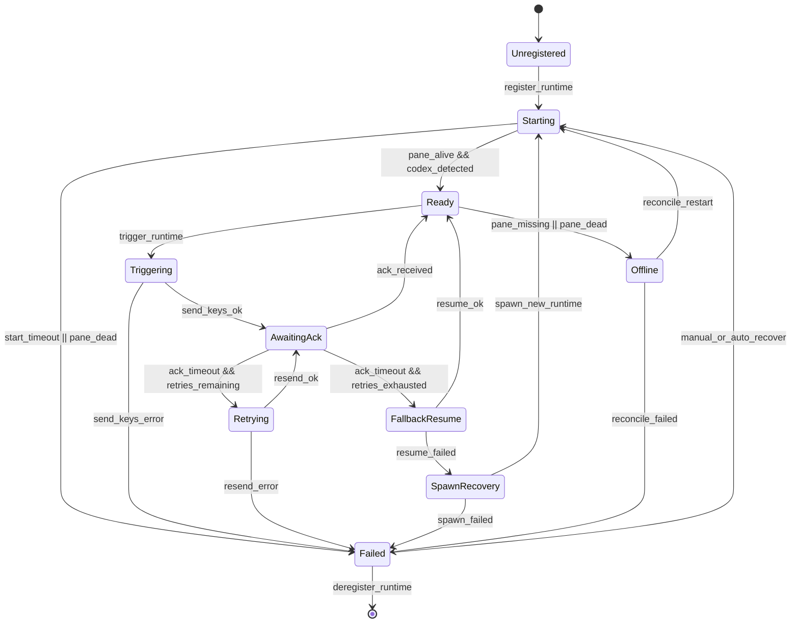

# tmux Supervisor Implementation Spec

## 1. Objective
Provide a concrete implementation spec for the PTY supervisor on WSL/Linux using `tmux` as the process-control backend. This spec defines command-level operations, runtime metadata, trigger handling, acknowledgement policy, and failure state machine behavior.

## 2. Scope
In scope:
- Managing agent runtimes inside named `tmux` targets.
- Sending trigger prompts to running agent processes.
- Detecting delivery/ack/failure outcomes.
- Recovering from pane/session/process failures.
- Collision-aware trigger scheduling when operator input overlaps with automation.

Out of scope:
- Windows ConPTY implementation details.
- GUI keystroke automation against unmanaged terminal windows.
- Multi-host orchestration.

## 3. Prerequisites
- `tmux >= 3.2` installed and available in PATH.
- `codex` CLI installed on host.
- Supervisor service has permission to execute `tmux` and `codex` commands.
- Agent roles and workspace IDs are preconfigured.
- Platform identity issuer is available for short-lived runtime tokens.

Verification commands:
```bash
tmux -V
command -v codex
```

## 4. Naming Conventions
Use deterministic names to avoid ambiguous targets.

- tmux session: `agents_<workspace_slug>`
- window name: `<agent_role>` (example: `executioner`, `reviewer`)
- pane index: default `0` unless split panes are intentionally used
- runtime target string: `<session_name>:<window_name>.<pane_index>`

Example:
- workspace: `mobile_core`
- session: `agents_mobile_core`
- reviewer target: `agents_mobile_core:reviewer.0`

## 4.1 Control Interaction Model
Default:
- human operator talks to orchestrator agent as primary interface
- orchestrator dispatches prompts/triggers to worker panes

Override:
- human may send direct input to any worker pane for intervention/debug
- after direct intervention, orchestrator should receive a synchronization prompt

## 4.2 Managed Runtime Policy
- Any worker that participates in autonomous trigger flow must be launched as a managed runtime in tmux.
- Unmanaged terminals are allowed for ad-hoc/manual usage only.
- If target runtime is unmanaged, supervisor must reject process-trigger delivery and return fallback-required result.

## 5. Runtime Registry Model
Each managed runtime record stores:
- `runtime_id`
- `agent_id`
- `workspace_id`
- `session_id` (Codex logical session)
- `tmux_session`
- `tmux_window`
- `tmux_pane`
- `tmux_target` (computed)
- `pid` (pane active process PID)
- `status` (`starting`, `ready`, `triggering`, `awaiting_ack`, `failed`, `offline`)
- `operator_busy` (bool)
- `last_heartbeat_at`
- `last_trigger_id`

## 6. Supervisor Command-Level Operations
## 6.1 Ensure tmux session exists
```bash
tmux has-session -t "agents_mobile_core"
```
If exit code != 0:
```bash
tmux new-session -d -s "agents_mobile_core" -n "bootstrap"
```

## 6.2 Ensure agent window exists
```bash
tmux list-windows -t "agents_mobile_core" -F '#{window_name}' | rg -x "reviewer"
```
If missing:
```bash
tmux new-window -d -t "agents_mobile_core" -n "reviewer"
```

## 6.3 Start managed Codex runtime in pane
Target pane: `agents_mobile_core:reviewer.0`

Launch command pattern:
```bash
tmux send-keys -t "agents_mobile_core:reviewer.0" \
  "cd /mnt/c/Development/_CORE/mobile-core-kit && codex" C-m
```

Optional seeded startup prompt:
```bash
tmux send-keys -t "agents_mobile_core:reviewer.0" \
  "You are reviewer_agent for workspace mobile_core. Await bridge triggers." C-m
```

## 6.4 Resolve pane metadata for registry
Active pane PID:
```bash
tmux display-message -p -t "agents_mobile_core:reviewer.0" '#{pane_pid}'
```
Pane current command:
```bash
tmux display-message -p -t "agents_mobile_core:reviewer.0" '#{pane_current_command}'
```
Pane dead flag:
```bash
tmux display-message -p -t "agents_mobile_core:reviewer.0" '#{pane_dead}'
```

## 6.5 Trigger delivery (write prompt into running process)
Construct trigger envelope:
```text
[BRIDGE_TRIGGER id=trg_20260217_0001 thread=th_01JXYZ reason=new_unread_messages]
Read unread messages for thread th_01JXYZ, continue reviewer workflow, then post status update.
[/BRIDGE_TRIGGER]
```

Delivery command:
```bash
tmux send-keys -t "agents_mobile_core:reviewer.0" \
  "[BRIDGE_TRIGGER id=trg_20260217_0001 thread=th_01JXYZ reason=new_unread_messages]" C-m \
  "Read unread messages for thread th_01JXYZ, continue reviewer workflow, then post status update." C-m \
  "[/BRIDGE_TRIGGER]" C-m
```

## 6.6 Human-input collision pre-check and defer
Detect recent pane activity:
```bash
tmux display-message -p -t "agents_mobile_core:reviewer.0" '#{pane_active}|#{session_attached}'
```

Policy defaults:
- quiet window required before injection: `20s`
- defer re-check interval: `5s`
- max defer window: `60s`
- if max defer exceeded, return `DEFER_TIMEOUT` and fallback to `codex exec resume`
- force override allowed only with explicit operator action (`force_override=true`)

## 6.7 Capture output for delivery diagnostics
Recent pane output:
```bash
tmux capture-pane -p -t "agents_mobile_core:reviewer.0" -S -120
```
Use this only for diagnostics and with redaction rules.

## 6.8 Health check and reconciliation
List all panes with metadata:
```bash
tmux list-panes -a -F '#{session_name}|#{window_name}|#{pane_index}|#{pane_pid}|#{pane_dead}|#{pane_current_command}|#{pane_active}'
```

Reconcile rule examples:
- `pane_dead=1` -> mark runtime `offline`
- `pane_current_command != codex` for longer than grace window -> mark `failed`
- missing target pane -> recreate window and restart runtime

## 6.9 Graceful runtime stop
```bash
tmux send-keys -t "agents_mobile_core:reviewer.0" C-c
```
If still alive after timeout:
```bash
tmux kill-pane -t "agents_mobile_core:reviewer.0"
```

## 7. Trigger Workflow
## 7.1 Happy path
1. Bridge identifies unread messages for `reviewer_agent`.
2. Supervisor validates `tmux_target` exists.
3. Supervisor writes trigger envelope with `tmux send-keys`.
4. Runtime status -> `awaiting_ack`.
5. Ack detector observes one of:
- bridge cursor advanced by target agent
- heartbeat updated by target runtime
- explicit runtime ack marker in pane output
6. Trigger status -> `delivered`.

## 7.2 Timeout and fallback
1. No ack before `ack_timeout_ms`.
2. Retry `send-keys` up to retry limit.
3. If still no ack, status -> `failed`.
4. Call fallback path:
- `codex exec resume <session_id> "<trigger prompt>"`
5. If resume fails, spawn new session with thread summary.

## 7.3 Human collision deferred path
1. Supervisor detects operator-busy pane.
2. Trigger state -> `deferred` and queued.
3. Re-check every `5s` until quiet window (`20s`) is satisfied.
4. If quiet window satisfied before `60s`, deliver trigger and continue normal ack flow.
5. If `60s` exceeded, return `DEFER_TIMEOUT` and switch to resume fallback.
6. If operator explicitly requests force override, inject immediately and audit as override event.

Resume/spawn defaults (MVP):
- resume attempts: 2
- stale session cutoff: `>12h` since last heartbeat
- crash-loop shortcut: if `>=3` failures in `15m`, skip resume and spawn

## 8. Ack Detection Strategy
Primary ack signals (priority order):
1. `read_messages` cursor progressed by target `agent_id`.
2. `heartbeat_session` update with status `active` or `idle` after trigger timestamp.
3. Optional pane marker match from `capture-pane` (example: `ACK_TRIGGER:trg_...`).

Ack timeout defaults:
- initial: 8 seconds
- retries: 2
- backoff: 2s then 4s

## 8.1 Loop Safeguard Defaults
- no-progress auto-block threshold: 20 turns
- repeated-identical-finding auto-block threshold: 3 cycles
- blocked thread requires orchestrator/human explicit continuation decision

## 9. Failure State Machine


## 10. Failure Classification
- `TARGET_NOT_FOUND`: tmux session/window/pane not found.
- `PANE_DEAD`: pane exists but process dead.
- `SEND_KEYS_ERROR`: tmux command execution failed.
- `ACK_TIMEOUT`: no acknowledgement after retries.
- `OPERATOR_BUSY`: runtime busy due to active human input; trigger deferred.
- `DEFER_TIMEOUT`: deferred trigger exceeded max defer window.
- `RESUME_FAILED`: fallback resume command failed.
- `SPAWN_FAILED`: new runtime could not be started.
- `REGISTRY_DRIFT`: runtime record no longer matches actual tmux state.
- `TRIGGER_RATE_LIMITED`: per-thread/agent rate limit gate deferred the trigger.
- `THREAD_AUTO_BLOCKED`: loop safeguard threshold reached and thread was auto-blocked.

## 11. Reconciliation Loop
Interval: every 5 seconds (configurable).

Algorithm:
1. Enumerate registry runtimes for workspace.
2. Probe tmux targets with `list-panes`/`display-message`.
3. Compare runtime record vs live tmux state.
4. Apply transitions:
- valid and alive -> `ready`
- missing/dead -> `offline`
- offline beyond threshold -> attempt restart
- repeated restart failures -> `failed`

## 12. Security and Safety Controls
- Trigger payload is text-only and length-limited.
- Control characters sanitized before `send-keys`.
- Restrict supervisor to allowlisted workspace directories.
- Audit every trigger with `trigger_id`, `agent_id`, `thread_id`, `result`.
- Redact pane captures before persistent logging.
- Runtime bridge calls must use platform-issued short-lived tokens; payload identity fields are not trusted.
- Force overrides on busy panes must include operator identity and explicit reason.

## 13. Observability
Metrics:
- `tmux_trigger_attempt_total`
- `tmux_trigger_delivered_total`
- `tmux_trigger_retry_total`
- `tmux_trigger_timeout_total`
- `tmux_runtime_restart_total`
- `tmux_reconcile_drift_total`

Structured events:
- `runtime_registered`
- `trigger_sent`
- `ack_received`
- `fallback_resume_started`
- `fallback_resume_succeeded`
- `runtime_restart_failed`

## 14. Example End-to-End Command Sequence
Example for first-time reviewer bootstrap and trigger:
```bash
# 1) ensure session
tmux has-session -t "agents_mobile_core" || tmux new-session -d -s "agents_mobile_core" -n "bootstrap"

# 2) ensure reviewer window
tmux list-windows -t "agents_mobile_core" -F '#{window_name}' | rg -x "reviewer" \
  || tmux new-window -d -t "agents_mobile_core" -n "reviewer"

# 3) launch codex in reviewer pane
tmux send-keys -t "agents_mobile_core:reviewer.0" "cd /mnt/c/Development/_CORE/mobile-core-kit && codex" C-m

# 4) deliver trigger message
tmux send-keys -t "agents_mobile_core:reviewer.0" "[BRIDGE_TRIGGER id=trg_001 thread=th_01JXYZ]" C-m \
  "Please review unread updates and post findings." C-m "[/BRIDGE_TRIGGER]" C-m

# 5) inspect last output for diagnostics
tmux capture-pane -p -t "agents_mobile_core:reviewer.0" -S -80
```

## 15. MVP Acceptance Criteria
- Trigger to active managed runtime succeeds in >= 95% of pilot attempts.
- `ACK_TIMEOUT` falls back to resume path automatically.
- Busy-pane collision path defers triggers and falls back after max defer window.
- Supervisor reconciliation can recover from killed pane/process without manual registry edits.
- Human can attach and monitor all agent panes from tmux session.

## 16. Locked Implementation Defaults (MVP)
- Runtime topology: one tmux session per workspace.
- Worker layout: one pane/window per role.
- Ack strategy: explicit runtime ack marker is optional, not mandatory; delivery confirmation primarily uses read-cursor and heartbeat signals.
